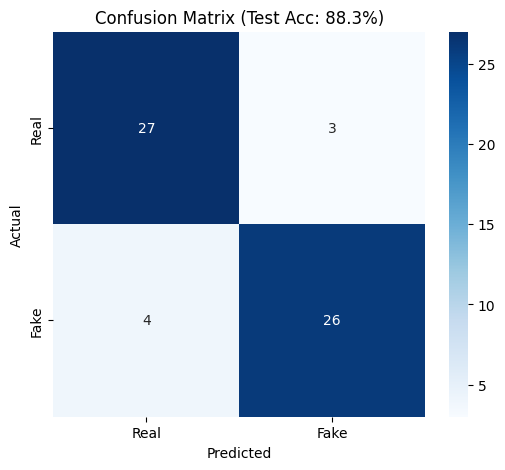

#  AI Audio Detection System (Deepfake Forensics)

> A Spectral Forensics system that detects AI-synthesized speech by analyzing high-frequency artifacts in Mel-Spectrograms.

##  The Research
Voice cloning models (like ElevenLabs, Vall-E) are becoming indistinguishable from human speech. However, they often introduce **spectral artifacts**—unnatural pixel patterns in the frequency domain—due to vocoder upsampling.

This project implements a **Custom CNN (ArtifactHunter)** to detect these patterns.

##  Key Results
We trained on the **ASVspoof 2019 Logical Access** dataset (subset) and achieved high detection accuracy.

### 1. Detection Performance
The model distinguishes between Real and Spoofed audio with minimal False Positives.

## How to Use
1. Clone this repository.
2. Install dependencies: `pip install -r requirements.txt`
3. Open `ai-audio-detection-system.ipynb` in Jupyter Lab, VS Code, or Google Colab.
4. Run all cells to download the sample data and train the model.

##  Tech Stack
* **Analysis:** Librosa, NumPy, Matplotlib
* **Deep Learning:** PyTorch, CNNs
* **Data:** ASVspoof 2019
